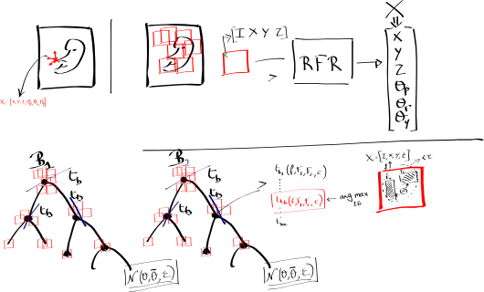

# Header

---------------------------

Find the following information about this article:

    Title: Real Time Head Pose Estimation with Random Regression Forests
    Author: Fanelli, Gall, Van Gool
    Journal/Conference: CVPR
    Year: 2011

This CVPR paper is a short version of the following IJCV:
Fanelli, Dantone, Gall, Fossati and Van Gool, "Random forests for real time 3D face analysis", *International Journal in Computer Vision*

# Graphical Abstract

---------------------------

# Highlight

---------------------------

* Estimation of nose position (x,y,z) and head orientation (yaw, pitch, roll),
* Random forest regression to obtain these parameters (the rest is in the graphical abstract),
* What about a combination of texture from 2D images with depth for faster convergence?
* Why of not using the geodedic distance instead of the vector nose, pixel-point position (x,y,z)?
* Why not use AdaBoost and Haar-like feature to generate F1 and F2 since that the computation can be performed even faster (cascade as in Viola and Jones)?
* Shall we remove the estimate with large variance or use it at something?

# Discussions

---------------------------
